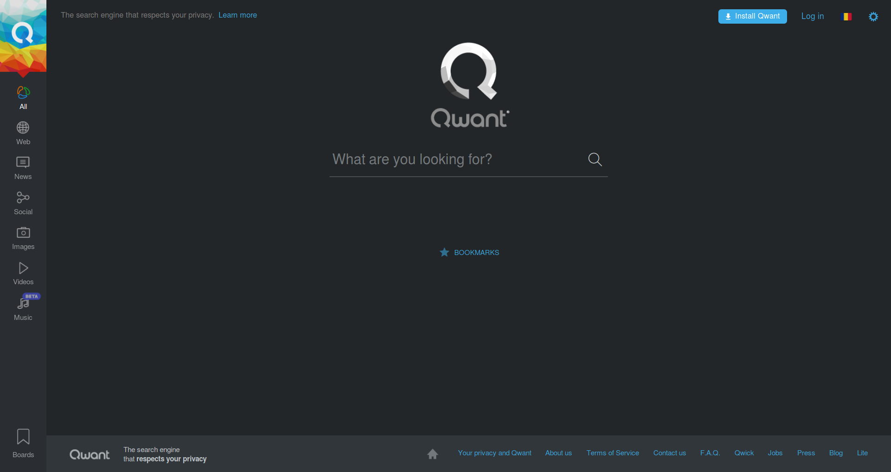
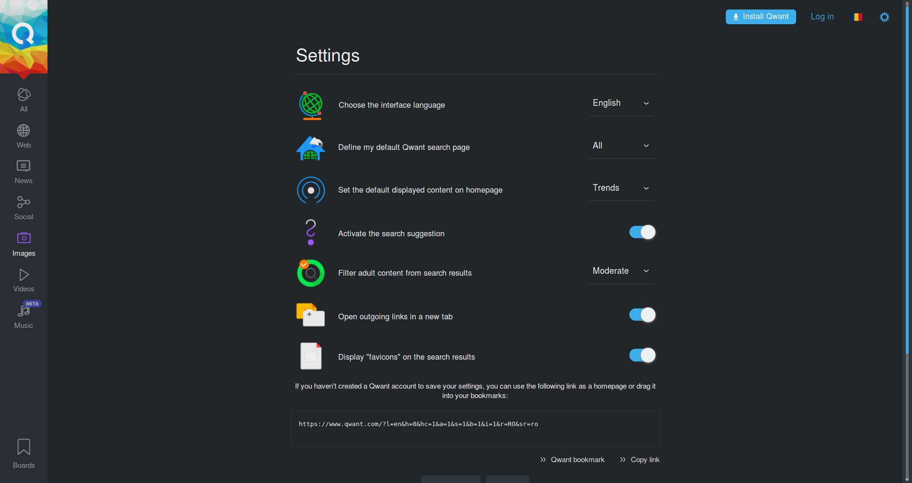
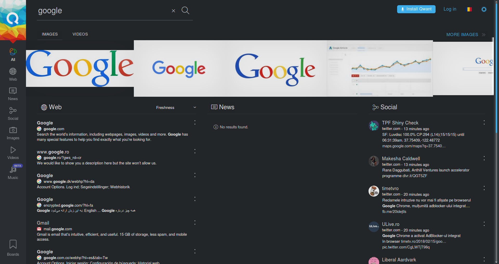
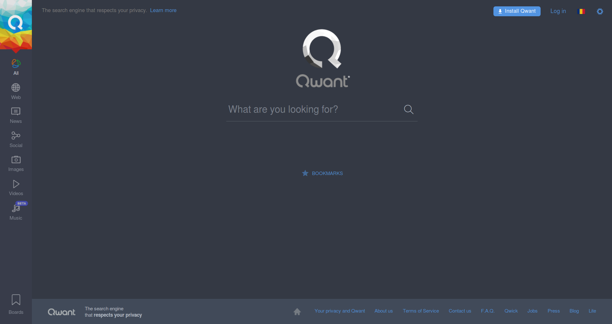
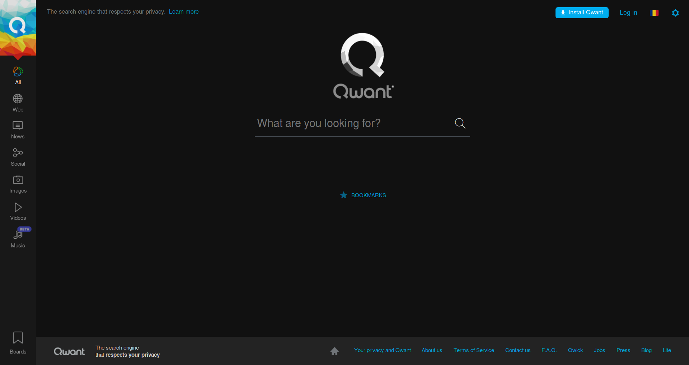
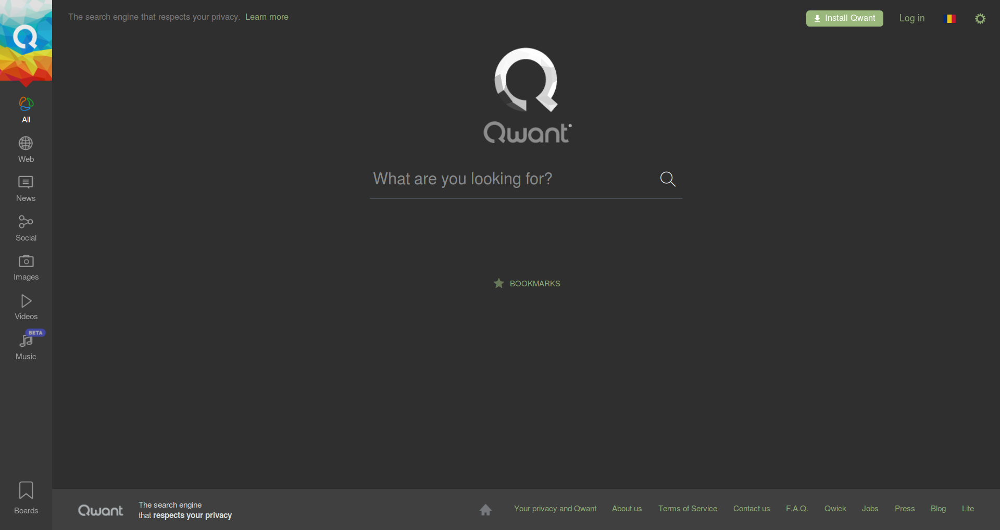

# Qwant-DeepDark

Light will blind you in your search for answers, dark will make them shine. May the dark be kinder on thine eyes. (Qwant dark theme)

This is a dark theme for Qwant inspired by [FT DeepDark](https://addons.mozilla.org/en-US/firefox/addon/ft-deepdark/?src=search).

Also, credit where credit is due for the color palettes down bellow. ([@KDE](https://github.com/KDE), [@horst3180](https://github.com/horst3180), [@linuxmint](https://github.com/linuxmint), [Firefox](https://www.mozilla.org/en-US/firefox/new/), [YouTube](https://www.youtube.com/) and [Discord](https://discordapp.com/))

Theme as a userstyle [here](https://openusercss.org/theme/5a85980170bc4a0b00903af9).

### **You can also install all my themes at once from [here](https://gitlab.com/RaitaroH/Import-All-Deepdark).**

# Screenshots

# Colors
Colors Showcase (the colors are available in the code; different colors can be used)

